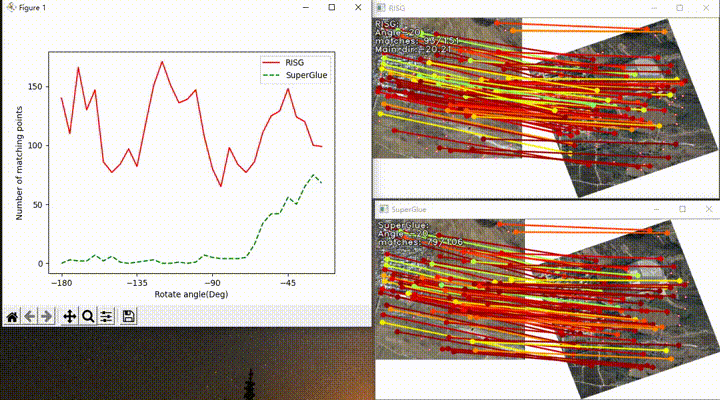
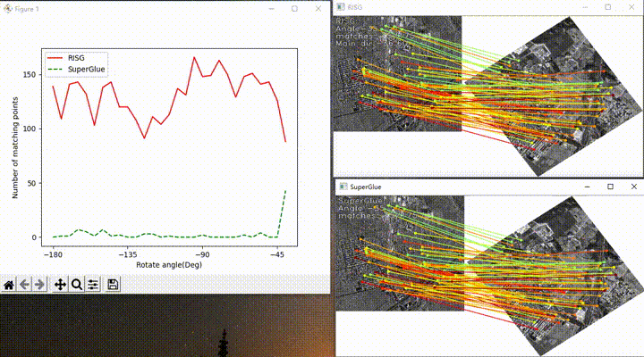

# RISG: A rotation invariant SuperGlue algorithm.

Some results are below： [also here, https://gitee.com/ssacn/RISG-image-matching](https://gitee.com/ssacn/RISG-image-matching)

# RISG: A rotation invariant SuperGlue algorithm.

Some results are here：

## 多时相谷歌地球影像，Optical-optical

## 近红外与光学图像 near-infrared - optical images

## SAR和光学图像，sar-optical

## 光学图像和夜光图像，optical- night light

## 地图鱼光学图像，map - optical

## 光学图像与激光雷达深度图，optical -lidar depth

## Source code coming soon...

## Source code is coming soon...
